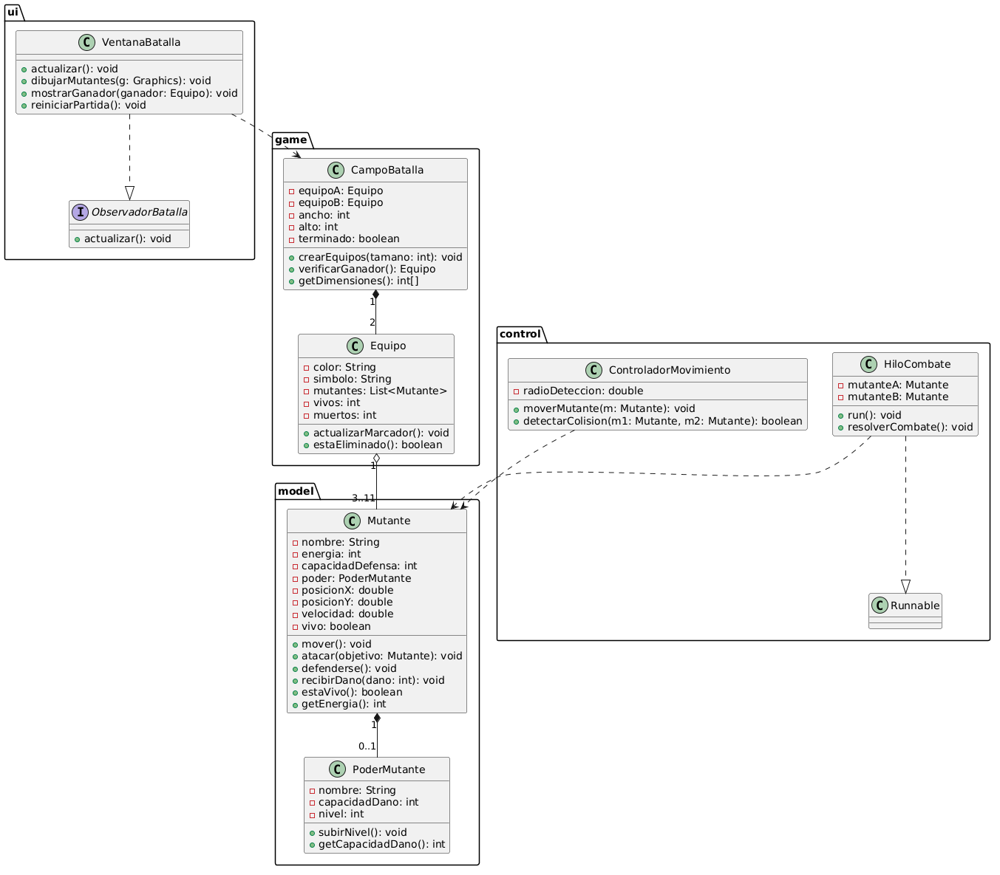

# Mutant Battle - Especificación de Clases

## Capa Modelo (`model`)

### Enum `EstadoMutante`
- `VIVO`
- `MUERTO`

### Clase `Posicion`
**Atributos:**
- `x: double`
- `y: double`

**Métodos:**
- `mover(double dx, double dy): void`
- `getX(): double`
- `getY(): double`

### Clase abstracta `PoderMutante`
**Atributos:**
- `nombre: String`
- `capacidadDano: int` — valor entre 1 y 3
- `nivel: int` — sube de 1 en 1 al dañar a un oponente, máximo 7

**Métodos:**
- `subirNivel(): void`
- `getCapacidadDano(): int`
- `aplicarEfecto(Mutante objetivo): void` — abstracto

**Subclases:** `PoderFuego`, `PoderHielo`, `PoderRayo`, `PoderTelequinesis`, `PoderInvisibilidad`

### Clase `Mutante`
**Atributos:**
- `nombre: String`
- `energia: int` — inicia en 100
- `capacidadDefensa: int` — valor entre 1 y 3
- `poder: PoderMutante` — máximo un poder por mutante
- `posicion: Posicion`
- `velocidad: double`
- `estado: EstadoMutante`

**Métodos:**
- `mover(int ancho, int alto): void`
- `atacar(Mutante objetivo): void`
- `defenderse(): void`
- `synchronized recibirDano(int dano): void`
- `estaVivo(): boolean`
- `getEnergia(): int`

---

## Capa Juego (`game`)

### Clase `Marcador`
**Atributos:**
- `vivos: int`, `muertos: int`, `puntos: int`

**Métodos:**
- `registrarBaja(): void`
- `registrarGolpe(int puntos): void`
- `getVivos(): int`
- `getMuertos(): int`

### Clase `Equipo`
**Atributos:**
- `color: Color`
- `simbolo: Image`
- `mutantes: List<Mutante>`
- `marcador: Marcador`

**Métodos:**
- `agregarMutante(Mutante m): void`
- `estaEliminado(): boolean`

### Clase `CampoBatalla`
**Atributos:**
- `equipoA: Equipo`
- `equipoB: Equipo`
- `ancho: int`, `alto: int`
- `terminado: boolean`

**Métodos:**
- `crearEquipos(int tamano): void`
- `verificarGanador(): Equipo`
- `getDimensiones(): int[]`

### Clase `MotorJuego`
**Atributos:**
- `campoBatalla: CampoBatalla`
- `gestorHilos: GestorHilos`
- `refrescoMs: int`

**Métodos:**
- `iniciarPartida(): void`
- `ejecutarCiclo(): void`
- `detenerPartida(): void`

---

## Capa Control (`control`)

### Enum `AccionCombate`
- `ATACAR`
- `DEFENDER`

### Clase `ParCombate`
**Atributos:**
- `mutanteA: Mutante`
- `mutanteB: Mutante`

### Clase `ControladorMovimiento`
**Atributos:**
- `radioDeteccion: double`

**Métodos:**
- `moverTodos(List<Mutante> mutantes, int ancho, int alto): void`
- `generarPatron(Mutante m): void`

### Clase `DetectorColisiones`
**Atributos:**
- `radioDeteccion: double`

**Métodos:**
- `detectarEncuentros(List<Mutante> equipoA, List<Mutante> equipoB): List<ParCombate>`

### Clase `ReglasCombate`
**Métodos (estáticos):**
- `decidirAccion(Mutante m): AccionCombate`
- `calcularDano(Mutante atacante, Mutante defensor, boolean seDefendio): int`

### Clase `GestorHilos`
**Atributos:**
- `executor: ExecutorService`
- `numHilos: int`

**Métodos:**
- `ejecutarCombates(List<ParCombate> pares): void`
- `esperarFinalizacion(): void`
- `apagar(): void`

### Clase `HiloCombate` (implementa `Runnable`)
**Atributos:**
- `par: ParCombate`

**Métodos:**
- `run(): void`
- `resolverCombate(): void`

---

## Capa UI (`ui`)

### Clase `VentanaBatalla` (extiende `JFrame`)
**Métodos:**
- `actualizar(): void` — implementa Observer
- `dibujarMutantes(Graphics g): void`
- `mostrarGanador(Equipo ganador): void`
- `reiniciarPartida(): void`

### Interfaz `ObservadorBatalla`
**Métodos:**
- `actualizar(): void`

---

## Diagrama UML

```plantuml
@startuml MutantBattle

package model {

  enum EstadoMutante {
    VIVO
    MUERTO
  }

  class Posicion {
    - x: double
    - y: double
    + mover(dx: double, dy: double): void
    + getX(): double
    + getY(): double
  }

  abstract class PoderMutante {
    - nombre: String
    - capacidadDano: int
    - nivel: int
    + subirNivel(): void
    + getCapacidadDano(): int
    + {abstract} aplicarEfecto(objetivo: Mutante): void
  }

  class PoderFuego extends PoderMutante {
    + aplicarEfecto(objetivo: Mutante): void
  }
  class PoderHielo extends PoderMutante {
    + aplicarEfecto(objetivo: Mutante): void
  }
  class PoderRayo extends PoderMutante {
    + aplicarEfecto(objetivo: Mutante): void
  }
  class PoderTelequinesis extends PoderMutante {
    + aplicarEfecto(objetivo: Mutante): void
  }
  class PoderInvisibilidad extends PoderMutante {
    + aplicarEfecto(objetivo: Mutante): void
  }

  class Mutante {
    - nombre: String
    - energia: int
    - capacidadDefensa: int
    - poder: PoderMutante
    - posicion: Posicion
    - velocidad: double
    - estado: EstadoMutante
    + mover(ancho: int, alto: int): void
    + atacar(objetivo: Mutante): void
    + defenderse(): void
    + synchronized recibirDano(dano: int): void
    + estaVivo(): boolean
    + getEnergia(): int
  }

  Mutante "1" *-- "1" Posicion
  Mutante "1" *-- "0..1" PoderMutante
}

package game {

  class Marcador {
    - vivos: int
    - muertos: int
    - puntos: int
    + registrarBaja(): void
    + registrarGolpe(puntos: int): void
    + getVivos(): int
    + getMuertos(): int
  }

  class Equipo {
    - color: Color
    - simbolo: Image
    - mutantes: List<Mutante>
    - marcador: Marcador
    + agregarMutante(m: Mutante): void
    + estaEliminado(): boolean
  }

  class CampoBatalla {
    - equipoA: Equipo
    - equipoB: Equipo
    - ancho: int
    - alto: int
    - terminado: boolean
    + crearEquipos(tamano: int): void
    + verificarGanador(): Equipo
    + getDimensiones(): int[]
  }

  class MotorJuego {
    - campoBatalla: CampoBatalla
    - gestorHilos: GestorHilos
    - refrescoMs: int
    + iniciarPartida(): void
    + ejecutarCiclo(): void
    + detenerPartida(): void
  }

  Equipo "1" *-- "1" Marcador
  Equipo "1" o-- "3..11" model.Mutante
  CampoBatalla "1" *-- "2" Equipo
  MotorJuego "1" *-- "1" CampoBatalla
}

package control {

  enum AccionCombate {
    ATACAR
    DEFENDER
  }

  class ParCombate {
    - mutanteA: model.Mutante
    - mutanteB: model.Mutante
  }

  class ControladorMovimiento {
    - radioDeteccion: double
    + moverTodos(mutantes: List<model.Mutante>, ancho: int, alto: int): void
    + generarPatron(m: model.Mutante): void
  }

  class DetectorColisiones {
    - radioDeteccion: double
    + detectarEncuentros(equipoA: List<model.Mutante>, equipoB: List<model.Mutante>): List<ParCombate>
  }

  class ReglasCombate {
    + {static} decidirAccion(m: model.Mutante): AccionCombate
    + {static} calcularDano(atacante: model.Mutante, defensor: model.Mutante, seDefendio: boolean): int
  }

  class GestorHilos {
    - executor: ExecutorService
    - numHilos: int
    + ejecutarCombates(pares: List<ParCombate>): void
    + esperarFinalizacion(): void
    + apagar(): void
  }

  class HiloCombate {
    - par: ParCombate
    + run(): void
    + resolverCombate(): void
  }

  HiloCombate ..|> Runnable
  HiloCombate ..> ReglasCombate
  HiloCombate "many" <-- GestorHilos
  DetectorColisiones ..> ParCombate
  GestorHilos ..> ParCombate
  MotorJuego ..> ControladorMovimiento
  MotorJuego ..> DetectorColisiones
  MotorJuego ..> GestorHilos
}

package ui {
  interface ObservadorBatalla {
    + actualizar(): void
  }

  class VentanaBatalla {
    + actualizar(): void
    + dibujarMutantes(g: Graphics): void
    + mostrarGanador(ganador: game.Equipo): void
    + reiniciarPartida(): void
  }

  VentanaBatalla ..|> ObservadorBatalla
  VentanaBatalla ..> game.MotorJuego
}

@enduml
```

