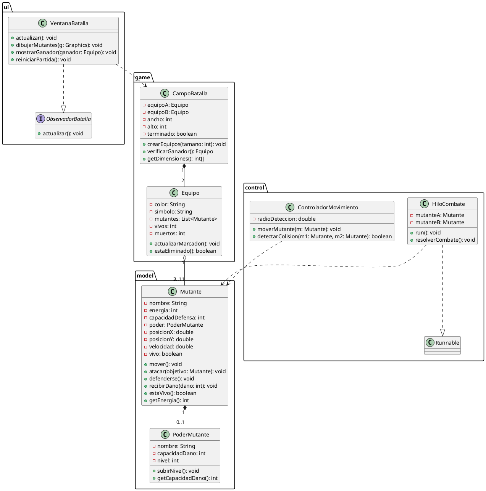

# Mutant Battle - Especificación de Clases

## Capa Modelo (`model`)

### Clase `Mutante`
**Atributos:**
- `nombre: String`
- `energia: int` — inicia en 100
- `capacidadDefensa: int` — valor entre 1 y 3
- `poder: PoderMutante` — máximo un poder por mutante
- `equipo: Equipo`
- `posicionX: double`, `posicionY: double`
- `velocidad: double`
- `vivo: boolean`

**Métodos:**
- `mover(): void`
- `atacar(Mutante objetivo): void`
- `defenderse(): void`
- `recibirDano(int dano): void`
- `estaVivo(): boolean`
- `getEnergia(): int`

### Clase `PoderMutante`
**Atributos:**
- `nombre: String`
- `capacidadDano: int` — valor entre 1 y 3
- `nivel: int` — sube de 1 en 1 al dañar a un oponente, máximo 7

**Métodos:**
- `subirNivel(): void`
- `getCapacidadDano(): int`

---

## Capa Juego (`game`)

### Clase `CampoBatalla`
**Atributos:**
- `equipoA: Equipo`
- `equipoB: Equipo`
- `ancho: int`, `alto: int`
- `terminado: boolean`

**Métodos:**
- `crearEquipos(int tamano): void`
- `verificarGanador(): Equipo`
- `getDimensiones(): int[]`

### Clase `Equipo`
**Atributos:**
- `color: String`
- `simbolo: String`
- `mutantes: List<Mutante>`
- `vivos: int`, `muertos: int`

**Métodos:**
- `actualizarMarcador(): void`
- `estaEliminado(): boolean`

---

## Capa Control (`control`)

### Clase `ControladorMovimiento`
**Atributos:**
- `radioDeteccion: double`

**Métodos:**
- `moverMutante(Mutante m): void`
- `detectarColision(Mutante m1, Mutante m2): boolean`

### Clase `HiloCombate` (implementa `Runnable`)
**Atributos:**
- `mutanteA: Mutante`
- `mutanteB: Mutante`

**Métodos:**
- `run(): void`
- `resolverCombate(): void`

---

## Capa UI (`ui`)

### Clase `VentanaBatalla` (extiende `JFrame`)
**Métodos:**
- `actualizar(): void` — implementa Observer
- `dibujarMutantes(Graphics g): void`
- `mostrarGanador(Equipo ganador): void`
- `reiniciarPartida(): void`

### Interfaz `ObservadorBatalla`
**Métodos:**
- `actualizar(): void`

---

## Diagrama UML

